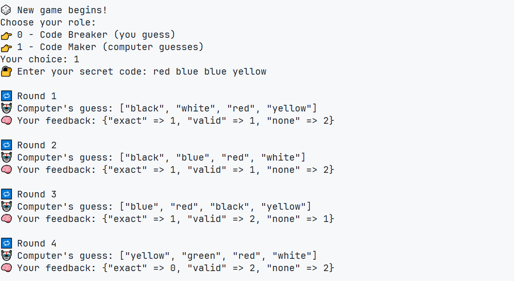
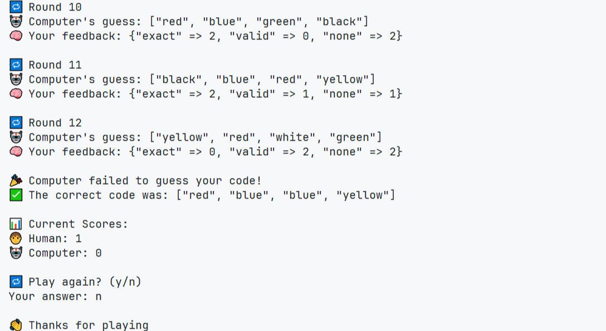

# 🧠 Mastermind

This is the eleventh project from [The Odin Project](https://github.com/TheOdinProject) curriculum — a command line Mastermind game where you can play as either the Code Breaker or the Code Maker against the computer.

## ✨ Preview

## 🎮 Gameplay Instructions

- Choose your role:

  - **Code Breaker**: Guess the computer’s secret code.
  - **Code Maker**: Set a code for the computer to guess.

- The code has 4 colors picked from:

  - `red`, `green`, `blue`, `black`, `white`, `yellow`

- You have 12 turns to guess or be guessed.

- After each guess, you get feedback:

  - `exact`: right color, right spot
  - `valid`: right color, wrong spot
  - `none`: color not in the code

- Winner gets 1 point. Scores show after each game.

- A new game starts after every round.

- Enter valid input only — wrong input might break the

## 🛠️ Skills Learned

### ♦️ Ruby Basics

- Basic Data Types
- Variables
- Input and Output
- Arrays
- Hashes
- Methods
- Range
- Basic Enumerable Methods
- Linting and RuboCop
- Object Oriented Programming
- Project Management
- Nested Collections
